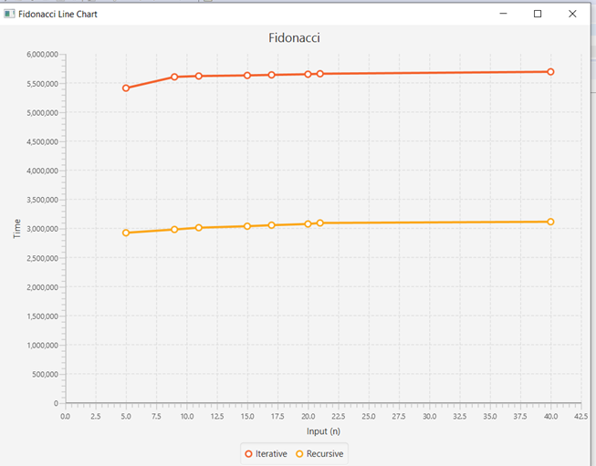

# FibonacciHomeWork
## Description
This porgram implements the Fibonacci function in both a recursive and iterative fashion. A line chart will display the results of a group of inputs, in order to show the runtime efficiency of the inputs using recursive and iterative fashion.
## Fibonacci
The sequence of numbers: 0,1,1,2,3,5,8,13,21,...

Each number equals the sum of the two numbers before it.

So after 1 and 1, the next number is 1+1=2, the next is 1+2=3, the next is 2+3=5 and so on.


## Setup
First the recursive method and iterative method was created.
```
//Recursive method
    public int fibRecursive(int n) {
        //If n is in the 0th or 1st place return n
        if (n <= 1)
            return n;
        return fibRecursive(n - 1) + fibRecursive(n - 2);
    }
    //Iterative method
    public int fibIterative(int n) {
        if (n <= 1)
            return n;
        int fib = 1, prevFib = 1;
        for (int i = 2; i < n; i++) {
            int temp = fib;
            fib += prevFib;
            prevFib = temp;
        }
        return fib;
    }
```
Then the runtime is set to nanoseconds.
```
    //Display and print running time
    public static void dispTime() {
        long startTime = System.nanoTime();
        System.out.println("time = " + (System.nanoTime() - startTime) + " nanosecs.");
    }
```
The line chart is set up below
```
 @Override public void start(Stage stage) {
  	
      stage.setTitle("Fibonacci Line Chart");
      //defining the axes
      final NumberAxis xAxis = new NumberAxis();
      final NumberAxis yAxis = new NumberAxis();
      xAxis.setLabel("Input (n)");
      yAxis.setLabel("Time");
      //creating the chart
      final LineChart<Number,Number> lineChart = 
              new LineChart<Number,Number>(xAxis,yAxis);
              
      lineChart.setTitle("Fibonacci");
      //defining a series
      XYChart.Series series = new XYChart.Series();
      series.setName("Iteration");
      XYChart.Series series2 = new XYChart.Series();
      series2.setName("Recursive");
```
The Fibonacci sequence for the sample inputs will display the results on the console.
```
//populating the series with data
      fibonacci fib = new fibonacci();
      Scanner input = new Scanner(System.in);

      //System.out.println("Enter a value for n: ");
      //int n = input.nextInt();	

      int n = 5;int n2 = 8; int n3 = 11;int n4 = 15;int n5 = 17;int n6 = 20;int n7 = 22;int n8 = 40;
    //Print out iteration method
      System.out.println("Iterative version:");
      long startTime = System.nanoTime();
      System.out.printf("Fibonacci sequence(element at index %d) = %d \n", n, fib.fibIterative(n));
      long q = System.nanoTime() - startTime;
      System.out.printf("Time: %d nanosecs\n", q);
      System.out.printf("Fibonacci sequence(element at index %d) = %d \n", n2, fib.fibIterative(n2));
      long q2 = System.nanoTime() - startTime;
      System.out.printf("Time: %d nanosecs\n", q2);
      System.out.printf("Fibonacci sequence(element at index %d) = %d \n", n3, fib.fibIterative(n3));
      long q3 = System.nanoTime() - startTime;
      System.out.printf("Time: %d nanosecs\n", q3);
      System.out.printf("Fibonacci sequence(element at index %d) = %d \n", n4, fib.fibIterative(n4));
      long q4 = System.nanoTime() - startTime;
      System.out.printf("Time: %d nanosecs\n", q4);
      System.out.printf("Fibonacci sequence(element at index %d) = %d \n", n5, fib.fibIterative(n5));
      long q5 = System.nanoTime() - startTime;
      System.out.printf("Time: %d nanosecs\n", q5);
      System.out.printf("Fibonacci sequence(element at index %d) = %d \n", n6, fib.fibIterative(n6));
      long q6 = System.nanoTime() - startTime;
      System.out.printf("Time: %d nanosecs\n", q6);
      System.out.printf("Fibonacci sequence(element at index %d) = %d \n", n7, fib.fibIterative(n7));
      long q7 = System.nanoTime() - startTime;
      System.out.printf("Time: %d nanosecs\n", q7);
      System.out.printf("Fibonacci sequence(element at index %d) = %d \n", n8, fib.fibIterative(n8));
      long q8 = System.nanoTime() - startTime;
      System.out.printf("Time: %d nanosecs\n", q8);
```
The results will also be displayed in a line chart
```
series.getData().add(new XYChart.Data(n,System.nanoTime() - startTime));
      series.getData().add(new XYChart.Data(n2,System.nanoTime() - startTime));
      series.getData().add(new XYChart.Data(n3,System.nanoTime() - startTime));
      series.getData().add(new XYChart.Data(n4,System.nanoTime() - startTime));
      series.getData().add(new XYChart.Data(n5,System.nanoTime() - startTime));
      series.getData().add(new XYChart.Data(n6,System.nanoTime() - startTime));
      series.getData().add(new XYChart.Data(n7,System.nanoTime() - startTime));
      series.getData().add(new XYChart.Data(n8,System.nanoTime() - startTime));
```

## Results

